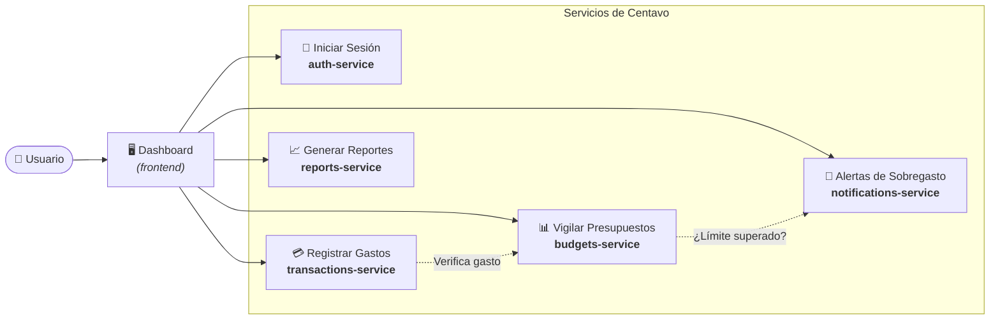

# Centavo 🪙

**Centavo** es una aplicación de finanzas personales diseñada para uso individual. Permite a los usuarios llevar un control riguroso de su dinero mediante el registro de gastos, fijación de presupuestos dinámicos, alertas automáticas de sobregasto y generación de reportes periódicos.

---

## 🏗️ Arquitectura del Sistema

El proyecto está estructurado como un **monorepo** compuesto por una aplicación frontend (dashboard) y cinco microservicios desacoplados e independientes.

### Diagrama de Arquitectura



---

## 📦 Estructura del Monorepo

```text
proyecto_prueba/
├── frontend/                 # Aplicación web / Dashboard para el usuario
├── auth-service/             # Servicio de autenticación y cuentas de usuario
├── transactions-service/     # Servicio de gestión y categorización de transacciones
├── budgets-service/          # Servicio de presupuestos y reglas de gasto
├── notifications-service/    # Servicio de emisión y gestión de alertas
├── reports-service/          # Servicio de análisis y reportes automáticos
└── README.md                 # Documentación global del monorepo
```

---

## 🧩 Propósito de Cada Componente

### 1. `frontend` (Dashboard)
- **Propósito**: Interfaz visual principal para el usuario.
- **Responsabilidades**:
  - Panel interactivo con resumen de saldo, gastos del mes y estado de presupuestos.
  - Formularios rápidos para registro y categorización de movimientos.
  - Visualización gráfica de gastos, alertas activas y reportes descargables.

### 2. `auth-service` (Autenticación)
- **Propósito**: Seguridad, control de acceso y gestión del perfil del usuario.
- **Responsabilidades**:
  - Registro, inicio de sesión y recuperación de credenciales.
  - Generación y validación de tokens de sesión (JWT / OAuth2).
  - Almacenamiento seguro de contraseñas y datos básicos de cuenta.

### 3. `transactions-service` (Transacciones)
- **Propósito**: Núcleo de registro y categorización de ingresos y gastos.
- **Responsabilidades**:
  - CRUD (creación, lectura, actualización y eliminación) de transacciones.
  - Asignación y aprendizaje de categorías de gasto (comida, transporte, ocio, etc.).
  - Filtros por fechas, métodos de pago, etiquetas y comercios.

### 4. `budgets-service` (Presupuestos)
- **Propósito**: Control de techos y límites de gasto por categoría o período.
- **Responsabilidades**:
  - Configuración de presupuestos mensuales, semanales o por proyectos específicos.
  - Monitoreo del porcentaje de consumo del presupuesto frente a las transacciones registradas.
  - Detección de umbrales críticos (ej. 80%, 100% de presupuesto consumido).

### 5. `notifications-service` (Alertas)
- **Propósito**: Gestión multicanal de avisos y notificaciones de sobregasto.
- **Responsabilidades**:
  - Envío de alertas inmediatas cuando un presupuesto es superado o está próximo a agotarse.
  - Notificaciones en la app, por correo o web push.
  - Preferencias de usuario para activación o silenciamiento de avisos.

### 6. `reports-service` (Reportes Automáticos)
- **Propósito**: Procesamiento analítico y generación de reportes financieros periódicos.
- **Responsabilidades**:
  - Generación de resúmenes semanales y balances de cierre de mes.
  - Identificación de tendencias y proyecciones de ahorro o sobreconsumo.
  - Exportación de información en formatos amigables (PDF, CSV, JSON).

---

## 🚀 Próximos Pasos Recomendados

1. **Definir el stack técnico** para cada microservicio (por ejemplo: Node.js/Express, Python/FastAPI, Go) y para el frontend (React, Next.js, Vite, etc.).
2. **Definir la capa de comunicación**: REST APIs, gRPC y/o cola de eventos (RabbitMQ, Redis Streams o Kafka) para la comunicación asíncrona entre servicios.
3. **Configuración de base de datos**: Diseñar esquemas relacionales (PostgreSQL/SQLite) o no relacionales según las necesidades de cada servicio.
